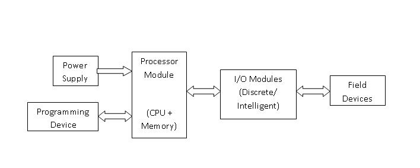
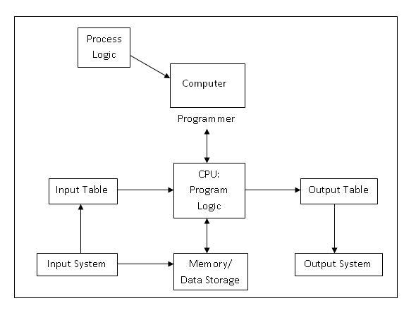
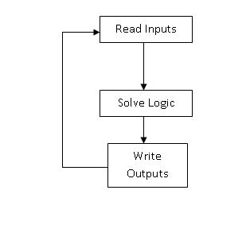
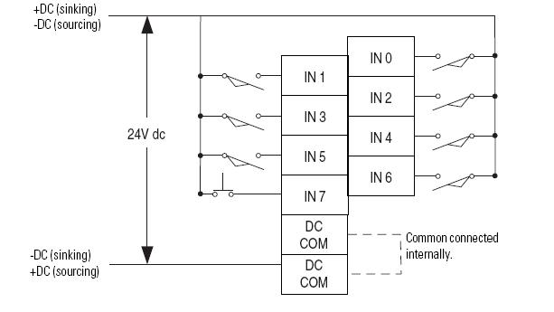
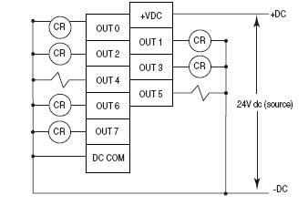

### Evolution of PLC:-

When the first electronic machine control was designed, relays were to control the machine logic.
Relay logic has its own limitations.

1. Less reliability
2. The delay involved in switching of contacts
3. Less flexibility and difficult troubleshooting due to hard wired connection

 ### What is PLC?

  A Programmable Logic Controller , PLC, or Programmable Controller is an electronic deviceused for Automation of industrial processes, such as control of machinery on factory assembly lines. A programmable controller is a digitally operating electronic apparatus which uses a programmable memory for the internal storage of instructions for implementing specific functions, such as logic, sequencing, timing, counting and arithmetic, to control various machines or processes through digital or analog input/output devices.Unlike general purpose computers, the PLC is designed for multiple inputs and output arrangements, extended temperature ranges, immunity to electrical noise, and resistance to vibrations and impacts.
  
Programs to control machine operation are typically stored in battery-backed or non volatile memory. A PLC is an example of a real time system since output results are produced in response to input conditions within a bounded time, otherwise unintended operation results.

### Basic Components of PLC:-

1. CPU and Memory module
2. Power supply
3. Input and output module
4. Programming device

* #####  CPU and Memory Module:-
This is the device where PLC program is stored and processed. The size and type of CPU determines the programming functions available, size of the application logic available, amount of memory supported, and processing speed.
- ##### Power Supply:-
The power supply provides power for the PLC system. It provides internal DC current to operate the processor logic circuitry and input/output assemblies. This can be built into the PLC or an external unit. Common voltage levels required by the PLC are 24Vdc, 120Vac, 220Vac. , is used to determine temperature.
- ##### Input and Output Module:-
Inputs carry signals from the field (process) to the controller. Various types of inputs can be switches, pressure sensors, transmitters etc. The field devices to whom PLC sends the results of logical operations are the output devices. These are the actuators that adjusts or control the process, motors, lights, relays, pumps, etc. Many types of inputs and outputs can be connected to a PLC and they can be categorized mainly as analog and digital. Digital inputs and outputs operate on discrete or binary change i.e. on/off, open/close. Analog inputs and outputs change continuously with reference to time.

- ##### Programming Device:-

- The PLC is programmed using a special software using computer or hand Held Terminal(HHT) that can load and change the logic inside. 

### Operation of a PLC system:-:
The operation of the PLC is determined by 3 steps.

1. Reading the field status form input devices
2. Execution or solving the logic, and
3. Updating the output devices status.

### PLC Program:-
PLC Program is a Logic that is executed by the CPU. This logic can be written in the form of Ladder diagram, Instruction List, Sequential Function Charts, Structured text or Functional block diagram. These are the languages used for writing logic as per IEC standard. The program is then downloaded to the PLC. This is usually done by temporarily connecting the PC or HHT to the PLC. Once the program is downloaded to the CPU, it is usually not necessary for the PC to remain connected.

### PLC Scan:-
Once the program is downloaded in the CPU, the PLC is switched to "run" mode and the PLC executes the application program. The CPU regularly reads the status of the input devices, and sends data to the output devices as per the logical results after execution of the program. The process of Initialization when power is turned on, Reading inputs, Executing logic, and modifying outputs is called as PLC Scan Cycle.

### Memory
The logic or application program is stored in memory. As the PLC executes logic, it may also read and store values to memory. The values may be referenced by the application program.

 ### Input and Output Devices
Two major types of Input/Output modules are
1. Digital - binary devices which must be in one of the two states: on or off.
2. Analog - continuos devices - sense and respond to a range of values.

- ##### Digital I/O
Common digital field input devices include pushbuttons, limit switches, photo sensor etc. Common digital output devices include relays, motor starters, and solenoid valves.

- ##### Analog I/O
Common analog input devices are transmitters used for sensing various parameters. Common output signals include motor speed, valve position, air pressure, etc.

I/O modules connect "real world" field devices to the controller. They convert the electrical signals used in the field devices into electronic signals that can be used by the control system, and translate real world values to IO table values.

### I/O Wiring:-
##### Example of Input Module Wiring Diagram:-

##### Example of Output Wiring Diagram:-

##### Sinking and Sourcing Operation:-

 - If the device provides current to during it’s on state, the device is said to be souring current.
 - If the device receives current in the ON or true state, then it is sinking current.